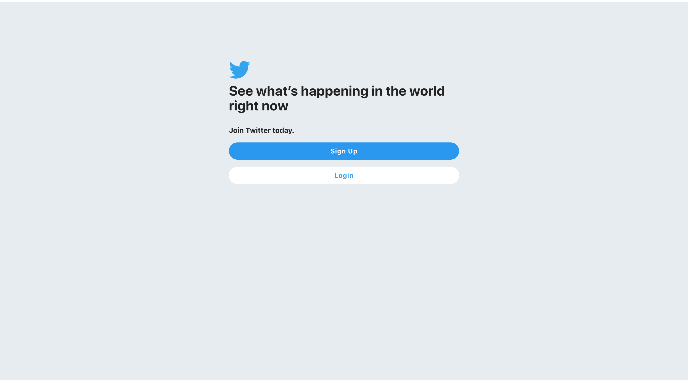
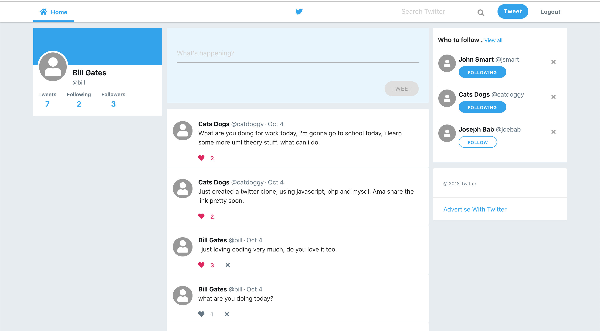
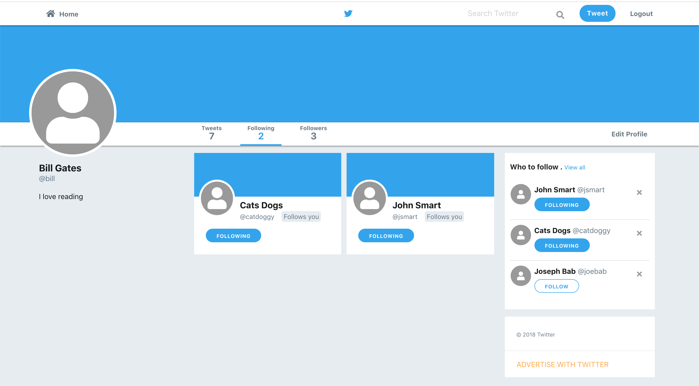

# Twitter Clone

A twitter clone with basic functionality like tweet, like tweet, following system etc.

## Development
Built with vanilla javascript, myql and [Boss PHP mini Framework](https://github.com/techreagan/Boss)

## Screenshot





## Installation
Import the twitter.sql to your mysql database 

### Fontawesome
Download fontawesome and include it in public/css/ the complete fontawesome folder

### Configuration File

Modify the app/config/config.php file according to your database credentials and also your root url

``` PHP
//Database Configuration
define('DB_HOST', '_YOUR_HOST');
define('DB_USER', '_YOUR_DATABSE_USERNAME');
define('DB_PASS', '_YOUR_DATABASE_PASSWORD');
define('DB_NAME', '_YOUR DATABASE_NAME');
// App Root 
define('APPROOT', dirname(dirname(__FILE__)));
// URL Root
define('URLROOT', '_YOUR_URL_');
```

### Htaccess file

Modify the .htaccess file inside the public folder to match the name of your installation folder, Modify only the RewriteBase.

```
<IfModule mod_rewrite.c>
  Options -Multiviews
  RewriteEngine On 
  RewriteBase /twitter/public 
  RewriteCond %{REQUEST_FILENAME} !-d 
  RewriteCond %{REQUEST_FILENAME} !-f 
  RewriteRule ^(.+)$ index.php?url=$1 [QSA,L]
</IfModule>
```

### Javascript files
Modify the javascript files in public/js. Change the url to your url. Files to modify, index.js, follow.js, search.js and profile.js
```Javascript
  let url = 'http://localhost:8888/twitter/';
```